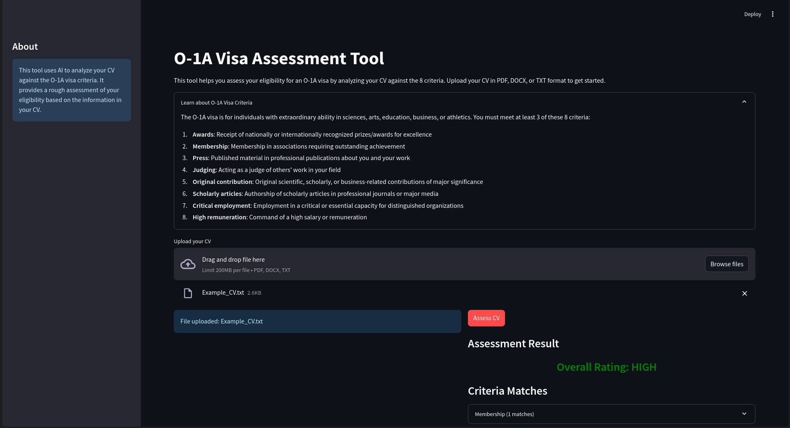

<div align="center">

# O-1A Visa Assessor

[](https://www.python.org/downloads/)
[](https://github.com/langchain-ai/langchain)
[](https://fastapi.tiangolo.com/)
[](https://streamlit.io/)

</div>
This tool helps individuals assess their eligibility for an O-1A visa by analyzing their CV against the 8 eligibility criteria established by USCIS.

### Overview
The **O-1A Visa Assessment Tool** uses AI to analyze CVs and provide a preliminary assessment of eligibility for the O-1A visa category. The system identifies relevant evidence matching the 8 criteria defined by USCIS and provides an overall rating of chances for approval.



###  Features
- Upload CVs in multiple formats (PDF, DOCX, TXT)
- Extract and analyze CV content using advanced AI
- Match CV content to the 8 O-1A visa criteria
- Provide confidence scores for each evidence match
- Generate an overall eligibility rating (Low, Medium, High)
- Present results in an easy-to-understand format

### How It Works
1. **Document Upload**: Users upload their CV in PDF, DOCX, or TXT format
2. **Text Extraction**: The system extracts text content from the document
3. **AI Analysis**: A RAG (Retrieval-Augmented Generation) system analyzes the text
4. **Criteria Matching**: The system identifies evidence matching the 8 O-1A criteria
5. **Assessment Generation**: Based on the matches, the system generates an overall rating

### Technical Architecture
The application consists of:

- **FastAPI Backend**: Handles document processing and assessment logic
- **RAG Engine**: Retrieval-augmented generation system for analyzing CV content
- **Streamlit Frontend**: User-friendly interface for document upload and results display

### Getting Started
**Prerequisites**
- Python 3.9+
- pip

**Installation**
1. Clone this repository:
```bash
git clone https://github.com/yash4agr/O-1A_Visa_Assessor.git
cd O-1A_Visa_Assessor
```
2. Create a virtual environment and activate it:
```bash
python -m venv .venv
source .venv/bin/activate  # On Windows: .venv\Scripts\activate
```
3. Install dependencies:
```bash
pip install -r requirements.txt
```
4. Create a `.env` file in the project root with your Together API key (Generate [Together AI API Key here](https://api.together.xyz/settings/api-keys)):
```bash
TOGETHER_API_KEY=your_api_key_here
```
**Running the Application**
1. Start the FastAPI backend:
```bash
python -m uvicorn main:app --reload
```
2. In a separate terminal, start the Streamlit frontend:
```bash
streamlit run streamlit.py
```
3. Open your browser and navigate to http://localhost:8501

### O-1A Visa Criteria
The O-1A visa is for individuals with extraordinary ability in sciences, arts, education, business, or athletics. To qualify, applicants must meet at least 3 of these 8 criteria:

1. **Awards**: Receipt of nationally or internationally recognized prizes/awards for excellence
2. **Membership**: Membership in associations requiring outstanding achievement
3. **Press**: Published material in professional publications about you and your work
4. **Judging**: Acting as a judge of others' work in your field
5. **Original contribution**: Original scientific, scholarly, or business-related contributions of major significance
6. **Scholarly articles**: Authorship of scholarly articles in professional journals or major media
7. **Critical employment**: Employment in a critical or essential capacity for distinguished organizations
8. **High remuneration**: Command of a high salary or remuneration
#### Interpreting Results
- **High Rating**: Excellent chance of meeting O-1A requirements, with 5+ criteria met with good confidence
- **Medium Rating**: Good chance of meeting O-1A requirements, with 3-4 criteria met with good confidence
- **Low Rating**: More evidence needed, with fewer than 3 criteria met with good confidence
#### Important Notes
- This tool provides a preliminary assessment only and is not legal advice
- Results should be reviewed by an immigration attorney
- The quality and detail of your CV directly affects assessment accuracy
- Different CV formats may produce slightly different results
### Project Structure
```
O-1A_Visa_Assessor/
├── api/
│   └── endpoints.py         # FastAPI endpoints
├── assets/                  # Images, Design document
├── core/
│   ├── assessment_engine.py # Assessment logic
│   ├── document_processor.py # Document parsing
│   └── rag_manager.py       # RAG implementation
├── config/
│   ├── prompts.py           # LLM prompts
│   └── settings.py          # Application settings
├── knowledge_base/          # Reference materials for RAG
├── models/
│   └── schemas.py           # Data models
├── main.py                  # FastAPI application
├── streamlit.py             # Streamlit interface
└── README.md                # Project documentation
```
### Design Choices and Evaluation
For a detailed explanation of design choices and evaluation guidelines, see [Design document](assets/Visa-Assessment-Tool-Design.pdf).

### License
This project is licensed under the MIT License - see the [LICENSE](LICENSE) file for details.